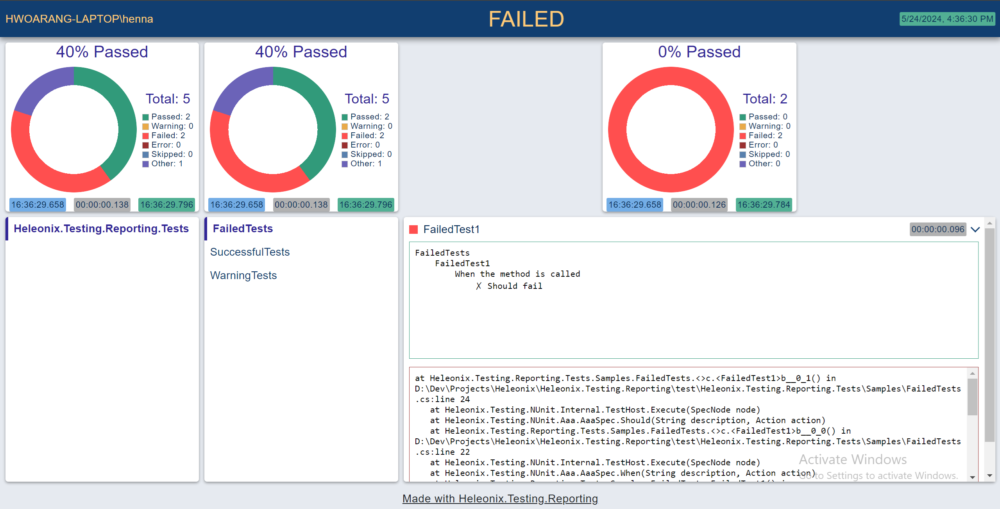
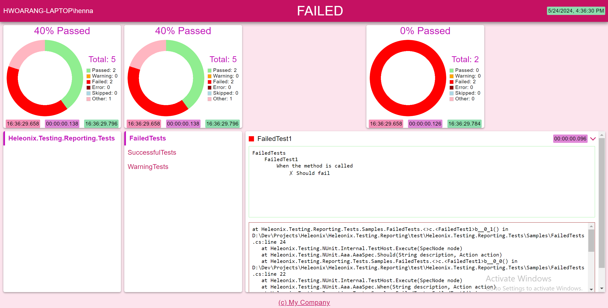

# Heleonix.Testing.Reporting

The .NET CLI tool to generate customizable human-friendly reports from technical test results.

## Install

https://www.nuget.org/packages/Heleonix.Testing.Reporting

## API

See <xref:Heleonix.Testing.Reporting>

## Command-line interface

|Option                                                                         | Description
|-------------------------------------------------------------------------------|
|-i, --input &lt;path&gt; (REQUIRED)                                            | Input files to generate reports from
|-o, --output &lt;path&gt; (REQUIRED)                                           | Path of the output file to store the generated merged report in (see the --merge option) or path of the folder to store multiple generated reports
|-f, --format &lt;Html&gt; (REQUIRED)                                           | Format of the output report
|-m, --merge                                                                    | Determines whether the input files should be merged into a single output report, or every input file should have a separate generated output report
|-s, --style &lt;variable-name=value&gt;                                        | The key=value pairs to specify custom styling via CSS variables, i.e. colors, for the output reports
|-c, --content &lt;property.path=value&gt;                                      | The key=value pairs to specify custom content replacements i.e. header or footer, in the output reports.
|-v, --verbosity &lt;Critical/Debug/Error/Information/None/Trace/Warning&gt; | Sets the verbosity level for logging [default: Information]
|--version                                                                      | Show version information
|-?, -h, --help                                                                 | Show help and usage information

### Styles

Possible values for the `--style` option:

Format | Values
-------|
Html   | See CSS 3 variables in the [Css.css](https://github.com/Heleonix/Heleonix.Testing.Reporting/blob/master/src/Heleonix.Testing.Reporting/Infrastructure/Html/Css.css) without `--` prefixes, i.e.: `color-primary`, `color-secondary` etc.

Styling approaches the [M2 Material Design](https://m2.material.io/) with set of color, typography, shaping and spacing variables.

To simplify your custom styling, you can use [Material Design palette tool](https://m2.material.io/design/color/the-color-system.html#tools-for-picking-colors).

### Content

Possible values of the `--content` option are dotted paths to properties in the [Report.cs](https://github.com/Heleonix/Heleonix.Testing.Reporting/blob/master/src/Heleonix.Testing.Reporting/Domain/Report.cs). 
For example: `Footer.Text`, `Footer.Url`, `Result.Summary.Title`, `Result.Summary.Owner` etc.

### Examples

`hxreport -i ./TestResult1.trx ./TestResult2.trx -o ./TestResult.html -f Html -m` 
Converts two TRX test results into a single merged Html output file.

`hxreport -i ./TestResult1.trx ./TestResult2.trx -o ./TestResultFolder -f Html` 
Converts two TRX test results into two Html output files placed in the `./TestResultFolder` folder.

Having the [Sample.trx](https://github.com/Heleonix/Heleonix.Testing.Reporting/blob/master/test/Heleonix.Testing.Reporting.Tests/Samples/Sample.trx),
the following Html report is generated: 
`hxreport -i ./Sample.trx -o ./Sample.html -f Html` 

Having the [Sample.trx](https://github.com/Heleonix/Heleonix.Testing.Reporting/blob/master/test/Heleonix.Testing.Reporting.Tests/Samples/Sample.trx),
the following Html report is generated, using the [Material Design palette tool](https://m2.material.io/design/color/the-color-system.html#tools-for-picking-colors)
and the primary `#C51162` color: 
`hxreport -i ./Sample.trx -o ./Sample.html -f Html -s color-primary=#c51162 color-on-primary=#ffffff color-secondary=#c511bc color-background=#fce4ed color-on-background=#c51162 color-on-surface=#000000 color-start=#f48fb6 color-end=#8eddae color-duration=#df87d7 color-passed=lightgreen color-failed=red color-error=darkred color-warning=orange color-skipped=lightblue color-other=lightpink color-undefined=lightgray -c Footer.Text="(c) My Company" Footer.Url="https://my.company.com"` 

## Contribution Guideline

1. [Create a fork](https://github.com/Heleonix/Heleonix.Testing.Reporting/fork) from the main repository
2. Implement whatever is needed
3. [Create a Pull Request](https://docs.github.com/en/pull-requests/collaborating-with-pull-requests/proposing-changes-to-your-work-with-pull-requests/creating-a-pull-request-from-a-fork).
   Make sure the assigned [Checks](https://docs.github.com/en/pull-requests/collaborating-with-pull-requests/collaborating-on-repositories-with-code-quality-features/about-status-checks#checks) pass successfully.
   You can watch the progress in the [PR: .NET](https://github.com/Heleonix/Heleonix.Testing.Reporting/actions/workflows/pr-net.yml) GitHub workflows
4. [Request review](https://docs.github.com/en/pull-requests/collaborating-with-pull-requests/proposing-changes-to-your-work-with-pull-requests/requesting-a-pull-request-review) from the code owner
5. Once approved, merge your Pull Request via [Squash and merge](https://docs.github.com/en/pull-requests/collaborating-with-pull-requests/incorporating-changes-from-a-pull-request/about-pull-request-merges#squash-and-merge-your-commits)
   > **IMPORTANT**  
   > While merging, enter a [Conventional Commits](https://www.conventionalcommits.org/) commit message.
   > This commit message will be used in automatically generated [Github Release Notes](https://github.com/Heleonix/Heleonix.Testing.Reporting/releases)
   > and [NuGet Release Notes](https://www.nuget.org/packages/Heleonix.Testing.Reporting/#releasenotes-body-tab)
6. Monitor the [Release: .NET / NuGet](https://github.com/Heleonix/Heleonix.Testing.Reporting/actions/workflows/release-net-nuget.yml)
   GitHub workflow to make sure your changes are delivered successfully
7. In case of any issues, please contact [heleonix.sln@gmail.com](mailto:heleonix.sln@gmail.com)
